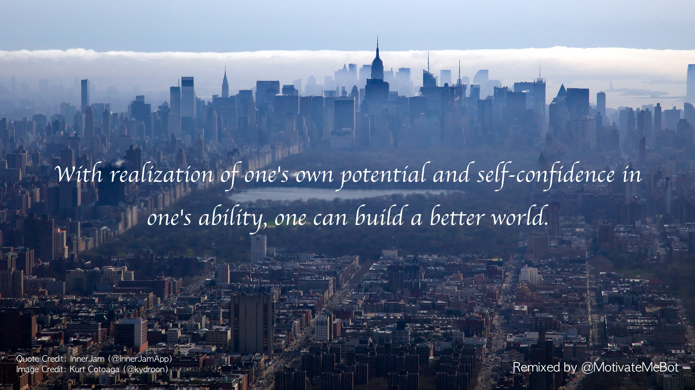

# motivate-me-bot 

### @MotivateMeBot is a Twitter bot that makes motivational pictures by combining pictures with tweets!

@MotivateMeBot is currently hosted on Heroku, running regularly using a scheduler. The bot selects images from [Unsplash](https://unsplash.com/?utm_source=MotivateMeBot&utm_medium=referral)'s excellent collection of high quality, royalty-free photos, via their API service. And of course, it uses the Twitter API to find tweets and post new remixed images.

To select an image, the bot first analyzes a couple positions for the quote (top and middle of image) and determines if the pixels at either position has a good distribution of [relative luminance](https://en.wikipedia.org/wiki/Relative_luminance). The bot may have to try multiple images before it selects one that passes the thresholds defined in the script.

Then, the bot selects quotes using a few language filters and does a bit of processing to format the text more appropriately for the image (e.g. removing hashtags, adding relevant punctuation, etc.). With a finalized quote, the text color is selected and the quote is arranged to maximize contrast with the background photo. In addition, the background image is blurred slightly (in a gradient manner, so that the boundary of the blurring region is hard to distinguish) to further enhance legibility.

After all of this processing, the bot pushes the remix to [Twitter](https://twitter.com/MotivateMeBot) with image and quote credits -- hopefully having successfully generated an inspiring picture!

---

Example scripts are located in `scripts/`. Specifically, `create_image_local.py` runs the tweet scraping / image & text editing pipeline. 

To run on your local machine, you'll need a Twitter Developer account and place the (4) keys in a file called `keys.py` within the `motivatemebot/` directory. In addition, you can sign up for an Unsplash account for access to their API as well (and place those keys in `keys.py` as well.

---

Credits for Twitter picture backgrounds (via [Unsplash](https://unsplash.com/?utm_source=MotivateMeBot&utm_medium=referral)):

* Profile picture: [John Rodenn Castillo](https://unsplash.com/photos/eluzJSfkNCk?utm_source=MotivateMeBot&utm_medium=referral)
* Cover photo: [Fezbot2000](https://unsplash.com/photos/wxGwllldlIQ?utm_source=MotivateMeBot&utm_medium=referral)
